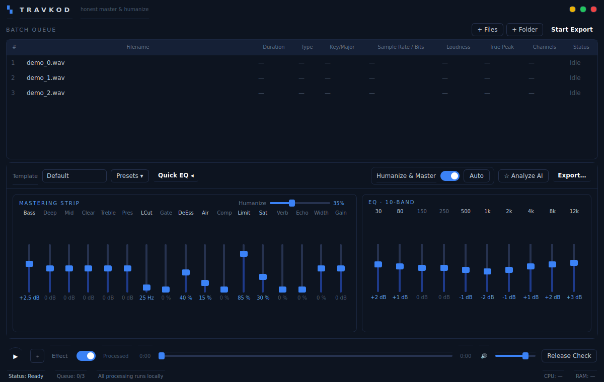

# TRAVKOD

**Honest humanize + master + batch-export for finished music (including AI renders).**

TRAVKOD takes finished stereo tracks — including AI-generated renders (e.g. from
Suno) — and makes them warmer, less brittle and release-ready, then batch-exports
them to WAV / FLAC / MP3. It is a **sound-quality** tool.



---

## Honest-use note (read this first)

TRAVKOD improves audio quality. **If your track uses AI, disclose it** where your
distributor requires.

TRAVKOD deliberately does **not**:

- try to evade, defeat, or "fool" any AI-detection system;
- help falsely attest human authorship to a distributor;
- help bypass a distributor's or streaming platform's AI-disclosure checks.

The **Authenticity Report** is informational only: it returns a *calibrated
probability with a confidence range* and is clearly labelled **Beta —
experimental, may be wrong**. It never guarantees a result and never frames its
output as "how to pass a check." Where a release would require AI disclosure, the
app **prompts you to disclose** — it does not help you hide it.

All processing runs **locally** on your machine by default. Nothing is uploaded.

---

## Architecture

TRAVKOD is a **pure-Python desktop app**: PyQt6 for the UI, calling the shared
DSP core directly on a thread pool. There is no separate backend process or IPC —
one process, one language.

```
PyQt6 UI ──signals──> QThreadPool worker pool ──> travkod DSP core
   ▲                        │                          │
   └──── progress ◄─────────┴──── per-file signals ◄───┘
Files: import queue -> humanize + master -> export (WAV/FLAC/MP3)
```

- **UI** — PyQt6, frameless dark window matching the reference (`python/travkod_app/`).
- **Worker pool** — `QThreadPool` sized to the user's "Threads" setting (1–8);
  each file is a `QRunnable` calling the DSP core and streaming progress via Qt
  signals. Statuses: Idle / Queued / Processing / Done / Error / Paused.
- **Engine** — `python/travkod/humanize_master.py`: low-cut → humanize
  (wow/flutter + micro-dynamics) → saturation → parametric + 10-band EQ → de-ess →
  gate → compression → air → reverb/echo → stereo width → true-peak limiter →
  LUFS normalize. Every stage is driven by the UI sliders.

The engine runs on `numpy`/`scipy`/`soundfile`/`pyloudnorm` alone; `librosa`
(key/pitch), `lameenc`/`ffmpeg` (MP3) and `pedalboard` are optional accelerators.

> An earlier **Electron + React** shell also lives in this repo (`electron/`,
> `src/`) driving the same `travkod` DSP core over a stdio worker (`worker.py`).
> The PyQt6 app is the primary, actively-built implementation.

---

## Features

- **Batch Queue** — `#, Filename, Duration, Type, Key/Major, Sample Rate/Bits,
  Loudness (LUFS), True Peak, Channels, Status`. Right-click: select all, add
  files/folder, remove, clear, analyze, start/stop export, open output.
- **Setting Console** — Template dropdown, Presets (save/load), Quick EQ, the full
  mastering strip and 10-band graphic EQ.
- **Humanize & Master** toggle — the main processing switch (Auto/Manual
  intensity). Its job is sound quality.
- **Export Settings** — Format (WAV/FLAC/MP3), sample rate, bit depth, threads
  (1–8), autotune, merge-to-one-file, LUFS target, output folder.
- **Release Readiness Check** — validates LUFS range, true-peak ≤ −1 dBTP, sample
  rate/bit depth, metadata; reminds you to disclose AI use where required.
- **Authenticity Report (Beta)** — calibrated `P(AI)` with a confidence interval
  and a plain-language "this is probabilistic" note.
- **Transport bar** — play/next, Effect toggle (A/B processed vs original),
  waveform scrubber, volume. Shortcuts: `Space` play/pause, `Cmd/Ctrl+E` export.

---

## Setup (development)

Requirements: **Python 3.11**. On Linux you also need Qt's runtime libs
(`libegl1 libgl1 libxkbcommon0 libglib2.0-0`); Windows/macOS wheels bundle them.

```bash
python3 -m venv .venv
source .venv/bin/activate            # Windows: .venv\Scripts\activate
pip install -r python/requirements.txt

# Run the app
python run_app.py                    # or:  cd python && python -m travkod_app
```

`requirements.txt` includes PyQt6 + psutil + the DSP stack. For just the engine
(no GUI), `requirements-core.txt` is enough.

### Verifying without a display

```bash
python python/tests/test_engine.py                       # DSP acceptance checks
QT_QPA_PLATFORM=offscreen python python/tests/test_app_smoke.py   # full app batch path, headless
```

---

## Building installers

The app is packaged with **PyInstaller** (see `scripts/build_pyinstaller.md`):

```bash
pip install pyinstaller
pyinstaller travkod.spec             # produces dist/TRAVKOD
```

This bundles Python, PyQt6 and the DSP stack into a single distributable — no
separate runtime needed on the target machine. **Code-signing** requires your own
certificates (`scripts/signing.md`).

<details><summary>Legacy Electron build</summary>

The Electron shell builds with `npm install && npm run dist`. Packaging embeds
the Python worker (`extraResources`); for a self-contained
installer, place a portable Python 3.11 runtime with the deps installed at
`python-embed/` before building (see `scripts/prepare_python.md`); otherwise the
app falls back to a system `python3`. **Code-signing** requires your own
certificates — see `scripts/signing.md`.

</details>

---

## Parameter reference

| Control | Unit | What it does |
| --- | --- | --- |
| Bass / Deep | dB | Low shelf (~80 Hz) / sub weight (~45 Hz) |
| Mid / Clear / Presence | dB | Mid bell (~800 Hz) / clarity (~3 kHz) / presence (~5 kHz) |
| Treble | dB | High shelf (~8 kHz) |
| Low-Cut | Hz | High-pass corner |
| Gate | % | Noise-floor downward expansion |
| De-Ess | % | Sibilance reduction (5–9 kHz) |
| Air | % | Very-high shelf shimmer (~14 kHz) |
| Comp | % | Bus compression amount |
| Limit | % | True-peak limiter drive (ceiling −1 dBTP) |
| Saturation | % | Analog-style harmonic warmth |
| Reverb / Echo | % | Subtle plate reverb / slap echo |
| Width | % | Stereo width (−100 narrow … +100 wide) |
| Gain | dB | Output trim (pre-limiter) |
| Humanize | % | Wow/flutter depth + micro-dynamic drift |
| EQ | dB | 10 bands: 30/80/150/250/500/1k/2k/4k/8k/12k Hz |

---

## License

MIT. See `LICENSE`.
